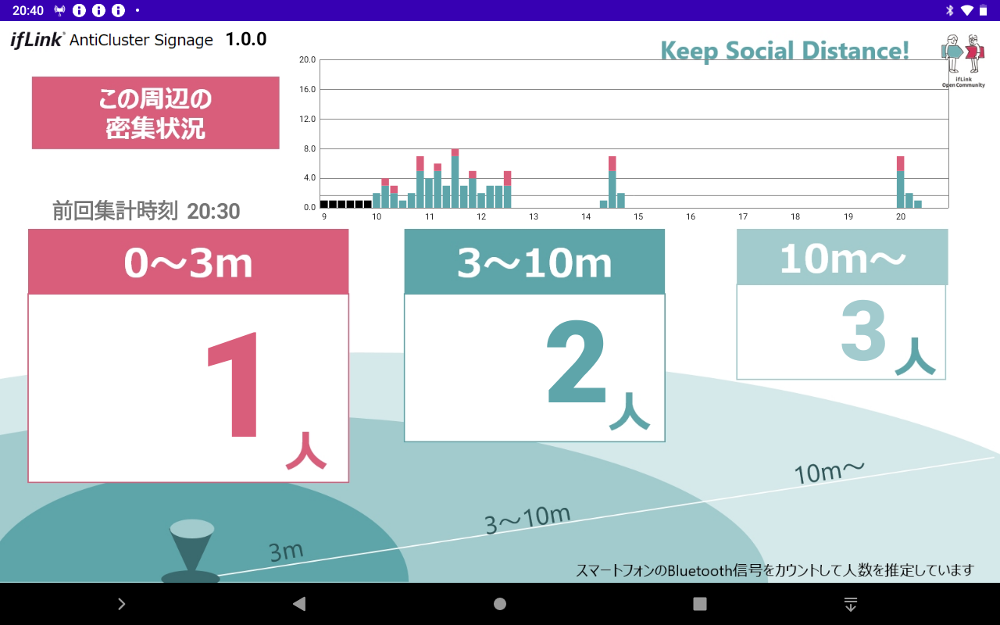

## About ifLink AntiCluster Signage

[English text follows the Japanese text.](#overview-1)

## Overview
スマートフォンが発信する電波を利用して近接をカウントするアプリである、AntiClusterを
常時設置して利用する用途に特化させたIMS（ifLinkマイクロサービス）アプリです。

## Description
スマートフォンがBluetooth機器接続のために発信しているAdvertisingパケットを受信し、電波強度に応じて「3m以内」「3～10m」「10m以上」の判定を行い、近接しているデバイスの数をカウントします。 
カウントの現在値は10分毎に集計・クリアされ、10m以下の値がリアルタイムにグラフに描画されます。 
このアプリは単独でも動作しますが、ifLinkがインストールされている場合、IFのIMSとして一定間隔でデータを送信します。

## Screenshots

## Requirement
- Android Studio 3.6.2
- Android SDK 29
- Android Build Tools v29.0.3

## Build
Gradleビルドシステムを使用しています。
1. Android Studioを起動し、"Open an existing Android Studio project"でフォルダを選択します。
2. "Make Project"でアプリをビルドします。
3. "Run'app'"でアプリを実行します。

## Usage
BluetoothをONにして使用してください。 
アプリを起動している間、Bluetooth機器のAdvertisingパケットをスキャンし、カウントします。 
アプリを終了するとカウントも停止しますが、設定画面にてバックグラウンドで動作を継続できるように変更できます。 
設定画面には、画面右上の端をタップすると遷移できます。 
 
カウント値は2週間分記録されていますが、グラフに描画されるのは当日午前9時から12時間分となります。
描画開始時刻は設定画面にて変更可能です。
また、グラフY軸の最小値は100となっていますが、こちらも設定画面にて変更可能です。
 
Advertisingパケットをスキャンするタイミングおよび電波強度の値は、Android端末に依存します。 
初期設定ではLow power（約5秒に1回、0.5秒間スキャン）設定ですが、設定画面で変更も可能です。 
（一般的に、スキャン頻度を上げるとバッテリー性能は低下します） 
 
電波強度に応じた距離判定の閾値も、設定画面で変更可能です。 
3mの推定基準は、初期設定では-65dBm以上です。 
10mの推定基準は、初期設定では-75dBm以上です。 
 
画面表示およびデータ送信する際のカウントは、デフォルトでは10分毎にリセットされますが、 
設定画面にて直近から指定した集計間隔[分]までのカウントに変更する事も可能です。 

## Usage for IfLink MicroService
デバイスサービスの登録には、以下のXMLファイルをご利用ください。 
[app/src/main/res/xml/device_service_anticlustersignage.xml](https://github.com/ifLink-AntiCluster/AntiClusterSignage/raw/master/app/src/main/res/xml/device_service_anticlustersignage.xml)

デバイスサービスは「AntiClusterサイネージ」で登録されます。IF条件として、以下が指定可能です。
* 3m以内カウント値が閾値を上回ったら
* 3～10mカウント値が閾値を上回ったら
* 10m以内カウント値が閾値を上回ったら
* 10m以上カウント値が閾値を上回ったら

IMS設定の配信には、以下のXMLファイルをご利用ください。 
[app/src/main/res/xml/setting_anticlustersignage.xml](https://github.com/ifLink-AntiCluster/AntiClusterSignage/raw/master/app/src/main/res/xml/setting_anticlustersignage.xml)

送信データは以下の通りです。
* near … 3m以内（0～3m）カウント値
* around … 3～10mカウント値
* active … 10m以内カウント値。near+aroundの値となります。
* far … 10m以上(10m～)カウント値
* unit_id … 端末識別用ID。設定画面から指定可能です。

データ送信の間隔はデフォルトで30秒ですが、設定画面で変更可能です。

## For debugging
デバッグ用に、スキャンしたデバイスのログを出力する機能と、 
内部で保持しているスキャン済みのデバイスの数を描画する機能があります。
- 「検出」は、検出したデバイスの重複のない数です。（10分毎にクリア）
- 「対象」は、検出からスマートフォンでないと判定されたデバイスを除外した数です。（10分毎にクリア）
- 「累計」は、対象の数と濃厚接触判定（3m以内で15分継続）した数を保持しています。実際の判定はこちらで行われます。

なお、カウントのロジックはAntiClusterと同様となっている為、0～3mは濃厚接触＋至近距離判定の値を表示しています。 

## Depends
このアプリでは以下のライブラリを使用しています。
- Gson
- MPAndroid Chart
- ifLink コアライブラリ
- ifLink IMSライブラリ
- ifLink UIユーティリティライブラリ

Android OS 7.0以降に対応しています。

## Sample Application
ソースコードをビルドしたサンプルアプリケーションを登録しています。 
[SampleApplication/anticluster_signage_v1.0.0.apk](https://github.com/ifLink-AntiCluster/AntiClusterSignage/raw/master/SampleApplication/anticluster_signage_v1.0.1.apk)

## Community
リクエスト、質問、バグリポートがある場合、GitHubのissue機能を使用して下さい。

## License
[MIT](./LICENSE)

## Disclaimer
本リポジトリに登録しているアプリケーションはソースコードをビルドした結果のサンプルであり、ソースコードの内容と変わりません。 
本リポジトリに登録しているアプリケーションの詳細、使用方法については、READMEに掲載している説明文を参照下さい。 
なお、本アプリケーションは、以下の事項を確認し、同意いただいたうえでご利用下さい。 

本アプリケーションの利用をもって、本免責事項に同意いただいたものとみなします。 
本アプリケーションのダウンロードおよびご利用については、利用者自身の責任において行われるものとします。 
ifLinkOpenCommunityは、本アプリケーションを使用することによって生じた、いかなる損害（有形無形に関わりなく）に対して責任を負いません。 
ご自身の責任においてご利用いただきますようお願いいたします。 
ifLinkOpenCommunityは、利用者に対し、本アプリケーションにおいて提供するすべての情報について、その正確性、有用性、最新性、適切性等、その内容について何ら法的保証をするものではありません。

## Link
[ifLink](https://iflink.jp/)

## Overview
This is an IMS (ifLink MicroService) application designed specifically for the constant installation and use of AntiCluster.

## Description
It receives the Advertising packets that the smartphone is sending out to connect to the Bluetooth device  
and counts the number of devices in close proximity by judging "within 3 meters", "between 3 to 10 meters" and "over 10 meters" according to the radio wave strength. 
The current value of the count is tallied and cleared every 10 minutes, and the value within 10 meters is drawn on the graph in real time.
The app can work on its own, but when the ifLink was installed, it will send data at regular intervals as an IMS for IF.

## Screenshots

## Requirement
- Android Studio 3.6.2
- Android SDK 29
- Android Build Tools v29.0.3

## Build
The Gradle build system is used.
1. Launch Android Studio and select a folder under "Open an existing Android Studio project".
2. Build your app with "Make Project".
3. "Run 'app'" to run the app.

## Usage
Please turn on the Bluetooth to use. 
While the app is running, it scans and counts the Advertising packets of Bluetooth devices. 
When you exit the app, also the count will stop on default. if you want to run in background, you can change it by the setting screen. 
To go to the setting screen, tap the top right corner of the screen. 
 
The count values have been recorded for two weeks, but they are drawn on the graph for 12 hours from 9:00 a.m. that day.
The drawing start time (9:00 a.m.) can be changed on the setting screen.
The minimum value for the Y axis of the graph is 100, but this can also be changed on the settings screen.
 
The timing and signal strength values for scanning Advertising packets are dependent on the Android device. 
The default setting is Low power (scan once every 5 seconds for 0.5 seconds), but this can be changed on the settings screen. 
(In general, the more often you scan, the less battery performance you'll get.) 
 
Thresholds of distance determination based on the radio wave strength can be changed on the setting screen. 
The default estimation criterion for 3 meters is -65 dBm or higher. 
The default estimation criterion for 10 meters is -75 dBm or higher.

## Usage for IfLink MicroService
*now translating and it will be available soon.*

## For debugging
There are 2 functions for debugging; output log of scanned devices and draw the number of scanned devices held internally. 
 
"SCN" is the number of unduplicated scanned devices. (will be cleared every 10 minutes) 
"CNT" is the number from "SCN" that excludes devices determined not to be smartphones. (will be cleared every 10 minutes) 
"TTL" is the number of "CNT" and the number of determined as "close contact" (criteria: within 3 meters and keep 15 minutes). 
The actual calculation is made on "TTL" basis. 
 
Since the logic of the count is the same as for AntiCluster, "within 3 meters" meens the count of "close contact" + "close proximity".

## Depends
The following libraries are used in this app.
- Gson
- MPAndroid Chart
- ifLink Core Library
- ifLink IMS Library
- ifLink UI Utility Library

Compatible with Android OS 7.0 or later.

## Sample Application
Here is a sample applicaiotn apk which built from the source code. 
[SampleApplication/anticluster_signage_v1.0.0.apk](https://github.com/ifLink-AntiCluster/AntiClusterSignage/raw/master/SampleApplication/anticluster_signage_v1.0.1.apk)

## Community
If you have a request, question, or bug report, please use the issue feature on GitHub.

## License
[MIT](./LICENSE)

## Disclaimer
The application registered in this repository is a sample of the result of building the source code, and it is not different from the content of the source code. 
For details of the applications registered in this repository and how to use them, please refer to the instructions in the README. 
Please use this application after confirming and agreeing to the following terms and conditions. 

By using this application, you agree to be bound by this disclaimer. 
Users are responsible for downloading and using this application. 
ifLink Open Community shall not be liable for any damage (whether tangible or intangible) caused by the use of this application. 
Please use the site at your own risk. 
ifLink Open Community makes no legal guarantee to the User of the accuracy, usefulness, timeliness or appropriateness of any information provided in the Application.

## Link
[ifLink](https://iflink.jp/)

